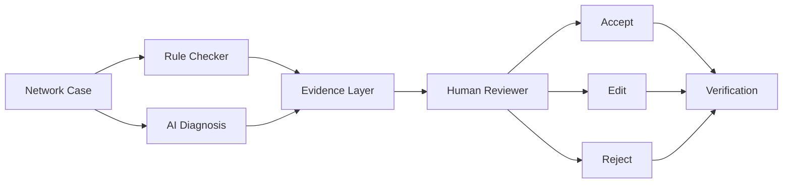

# NetSage AI

**AI-assisted network troubleshooting with mandatory human review, for
Cisco Packet Tracer coursework.**

> ⚠ **AI recommendations are advisory. A human reviewer must approve
> every diagnosis before a fix is accepted.**

---

## Problem

Junior network engineers often know individual Cisco commands but
struggle to connect a symptom to the actual root cause. A PC that gets
an IP address but can't reach a server could be caused by a VLAN
misconfiguration, a routing problem, a missing default gateway, DHCP,
DNS, an ACL, NAT, a shut interface, a trunk mismatch, wireless
isolation - or several of these at once.

NetSage AI helps a learner move from:

**Symptom → Evidence → Hypothesis → Next command → Fix → Human review → Verification**

## Solution

Every case is checked by **two independent evidence sources** that are
never merged into a single automated verdict:

1. **A deterministic rule checker** (`backend/rules/`) - plain
   regex/string inspection of `show`-command output. No LLM. Same input
   always produces the same output.
2. **An AI diagnosis** (`backend/ai/`) - an LLM call that reasons over
   the symptom, topology, and evidence, producing a structured,
   evidence-cited hypothesis with a calibrated confidence score.

Both are shown side by side to a human, who must **Accept**, **Edit**,
or **Reject** the AI's diagnosis before anything is considered a
resolution. That decision is the only thing ever written to the
Responsible AI log (`data/reviews.csv`). There is no code path,
anywhere in this project, that applies a configuration change to a
device automatically.

## Features

- **30 realistic troubleshooting cases** spanning VLANs, routing (static
  and OSPF), DHCP, DNS, ACLs, NAT, trunking (including native VLAN
  mismatch), interface state, subnetting, duplicate IPs, inter-VLAN
  routing, wireless connectivity/isolation/auth, STP, port security, and
  a multi-fault "mixed cause" case.
- **Google Gemini support with automatic model fallback** - selected via
  `.env`. If the primary model's quota is exhausted or it's temporarily
  unavailable, the app automatically retries the same request against
  the next model in a configurable fallback chain - see
  [Automatic model fallback](#automatic-model-fallback-gemini).
- **A fully offline demo/mock mode** - the entire app, including the AI
  diagnosis step, works with **zero API key configured**. Mock
  responses are deterministic and, for cases with existing review
  history, intentionally reproduce the same diagnosis a human already
  corrected - so the demo tells a consistent, honest story.
- **A deterministic rule checker** with 16 checks across IP addressing,
  VLANs, routing, DHCP, NAT, ACLs, and port security - runnable
  standalone via a CLI (`python checker.py`) or through the API.
- **A structured AI diagnosis pipeline** with a strict JSON contract
  (Pydantic-validated), evidence-grounding instructions, and graceful
  handling of malformed model output - the app never crashes on a bad
  AI response.
- **A mandatory human review workflow** (Accept / Edit / Reject) with a
  server-side-enforced requirement that a Reject include a reason.
- **A Responsible AI log** pre-seeded with 12 real review examples,
  including 5+ cases where a human corrected or outright rejected the
  AI - one of which (`STP-001`) shows the AI recommending something
  that would have made the network *less* safe.
- **A dashboard** with case/severity/OSI-layer breakdowns, AI vs human
  agreement rate, accepted/edited/rejected split, and rule-checker
  finding frequency.
- **Automated tests** for the rule checker, the dataset, the Gemini
  fallback logic, and the full API - including malformed-JSON handling
  and the Accept/Edit/Reject workflow (68 tests).

## Architecture



See [`docs/architecture.md`](docs/architecture.md) for the full module
map and data-flow walkthrough.

## Project structure

```
netsage-ai/
├── data/                  cases.csv (30 cases), reviews.csv (seeded review log)
├── prompts/               diagnose_prompt.md, examples.md
├── backend/                FastAPI app (see docs/architecture.md)
├── frontend/               React + TypeScript + Vite + Tailwind dashboard
├── tests/                  pytest suite (checker, dataset, API)
└── docs/                   architecture.md, demo_script.md, responsible_ai.md
```

## Installation

Requires **Python 3.11+** and **Node.js 18+**.

```bash
git clone <this-repo>
cd netsage-ai
```

### Backend setup

```bash
cd backend
pip install -r ../requirements.txt
cp ../.env.example ../.env   # optional - see "Environment variables" below
uvicorn main:app --reload
```

The API is now running at `http://127.0.0.1:8000`. Interactive docs at
`http://127.0.0.1:8000/docs`.

### Frontend setup

In a second terminal:

```bash
cd frontend
npm install
npm run dev
```

The app is now running at `http://127.0.0.1:5173`. The Vite dev server
proxies `/api/*` to the backend on `:8000` automatically (see
`frontend/vite.config.ts`) - no extra configuration needed.

## Environment variables

Copy `.env.example` to `.env` in the project root and edit as needed:

```env
# Provider selection (leave blank to auto-detect from which key is set)
AI_PROVIDER=

# Google Gemini
GEMINI_API_KEY=
GEMINI_MODEL=gemini-2.5-flash
GEMINI_FALLBACK_MODELS=gemini-2.5-flash-lite,gemini-2.0-flash-001,gemini-2.5-pro
```

**Leaving every key blank is fully supported.** The app detects that no
provider is configured and automatically runs the AI diagnosis step in
a deterministic mock mode - see [Demo mode](#demo-mode) below. This is
the expected setup for coursework that doesn't have API billing
configured.

**Get a free Gemini key** at https://aistudio.google.com/apikey, drop
it into `GEMINI_API_KEY`, and the app switches from mock mode to live
Gemini calls automatically - no other configuration needed. `AI_PROVIDER`
only needs to be set explicitly if you want to force mock mode even
though a key is present.

### Automatic model fallback (Gemini)

Free-tier API keys hit per-model rate and quota limits. Rather than
failing the whole diagnosis when that happens, NetSage AI automatically
retries the same request against the next model in
`GEMINI_FALLBACK_MODELS`:

- **Quota exhausted (HTTP 429 / `RESOURCE_EXHAUSTED`)** → immediately
  tries the next model; retrying the same model wouldn't help since the
  quota won't refill mid-request.
- **Model unavailable on your key/tier (404)** → falls back to the next
  model.
- **Transient server error (5xx)** → retries the *same* model twice
  with a short backoff first, then falls back if it's still failing.
- **Bad API key (401/403)** → fails immediately without wasting time
  trying every model, since an auth error affects all of them equally.

Every diagnosis response includes which model actually answered
(`model_used`) and whether a fallback occurred (`fallback_occurred`) -
the frontend surfaces this as a small badge on the AI Diagnosis card.
See `backend/ai/client.py::GeminiAIClient` and
`tests/test_gemini_fallback.py` (11 tests covering every branch above,
using a stubbed SDK so they run with no network access or API key).

## Demo mode

With no provider API key set, `POST /api/diagnose` returns
`"mock_mode": true` and a deterministic offline diagnosis instead of a
live model call. Two kinds of mock response exist:

- **Scripted responses** for the 7 cases that already have review
  history in `data/reviews.csv` (`backend/ai/mock_data.py`) - these
  intentionally reproduce the same flawed diagnosis a human reviewer
  already corrected, so mock mode and the seeded review log tell one
  consistent story.
- **Generated responses** for every other case, built directly from
  that case's ground-truth fields in `data/cases.csv`
  (`backend/ai/client.py::MockAIClient._generate_grounded_diagnosis`) -
  a well-calibrated, evidence-grounded diagnosis a reviewer would
  typically accept.

Follow [`docs/demo_script.md`](docs/demo_script.md) for a full 5–10
minute presentation walkthrough, including the recommended `STP-001`
case for demonstrating a human catching a bad AI suggestion.

To reset the review log back to its seeded state after a demo run:

```bash
cd data
python3 generate_reviews.py
```

## Testing

```bash
cd netsage-ai   # project root
python3 -m pytest tests/ -v
```

This runs 68 tests covering:
- Every deterministic rule-checker check (duplicate IP, wrong mask,
  gateway mismatch, interface down, missing VLAN, missing route, plus
  trunk config, native VLAN mismatch, DHCP pool issues, NAT issues, ACL
  findings, and port security).
- Dataset structural integrity (30+ cases, unique IDs, required fields,
  concept coverage, realistic show output).
- The full API, including malformed AI JSON handling and the
  Accept/Edit/Reject review workflow (with REJECTED correctly requiring
  a reason).
- The Gemini multi-model fallback logic (quota exhaustion, model
  unavailability, transient server errors, auth failures) using a
  stubbed SDK - no network access or real API key required to run
  these.

The rule checker also has its own standalone CLI:

```bash
cd backend/rules
python3 checker.py                  # run against every case
python3 checker.py --case VLAN-001  # run against a single case
python3 checker.py --json           # machine-readable output
```

## API reference

| Method | Path                  | Description                                  |
|--------|-----------------------|-----------------------------------------------|
| GET    | `/api/cases`          | List all cases                                |
| GET    | `/api/cases/{case_id}`| Get a single case                             |
| POST   | `/api/check`          | Run only the deterministic rule checker       |
| POST   | `/api/diagnose`       | Run rule checker + AI diagnosis               |
| GET    | `/api/reviews`        | List all recorded human reviews               |
| POST   | `/api/reviews`        | Record an Accept/Edit/Reject decision         |
| GET    | `/api/dashboard`      | Aggregate stats for the dashboard             |

Full interactive documentation (request/response schemas) is available
at `/docs` while the backend is running.

## Responsible AI

See [`docs/responsible_ai.md`](docs/responsible_ai.md) for a full
explanation of every layer at which "a human must review every
diagnosis" is enforced - not just stated - in this codebase, including
why a Pydantic model-level (not field-level) validator is used to
guarantee a REJECTED review always carries a reason, and a walkthrough
of the pre-seeded correction examples that show the AI being wrong, or
in one case, actively unsafe.

## License

This project is licensed under the MIT License - see the [LICENSE](LICENSE) file for details.
