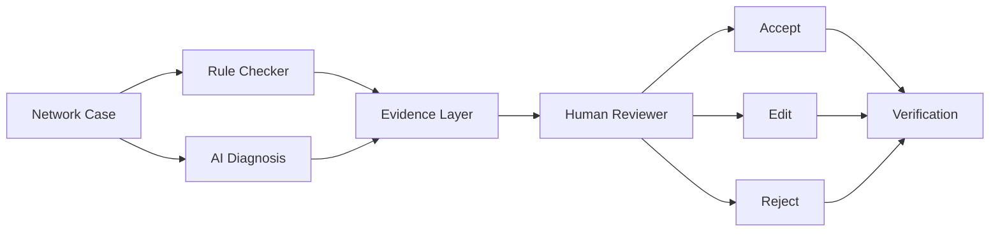

# NetSage AI - Architecture

## Pipeline overview



Two independent evidence sources feed the same human decision point:

- **Rule Checker** (`backend/rules/`) - deterministic, regex/string-based
  inspection of the case's `show`-command output. No LLM involved. Same
  input always produces the same output.
- **AI Diagnosis** (`backend/ai/`) - an LLM call (or, with no API key
  configured, a deterministic mock) that reasons over the symptom,
  topology note, and show output, plus the rule checker's findings as
  supplementary context.

Neither source can act on its own. Both are surfaced to a human
reviewer, who is the only actor that can record an ACCEPT / EDIT /
REJECT decision. That decision - never the AI's raw output - is what
gets written to `data/reviews.csv`, the Responsible AI log.

## Why two independent evidence sources

The rule checker and the AI are deliberately kept separate rather than
merged into one "smart" pipeline:

- The rule checker is auditable. Anyone can read `backend/rules/*.py`
  and know exactly what triggers a finding, with no model
  non-determinism to account for.
- The AI can reason about cases the rule checker can't cover
  deterministically (ambiguous symptoms, working-as-designed
  configurations that only look wrong, cases needing broader context).
- Showing both side-by-side, without merging them, lets a human
  reviewer see where they agree (reinforcing confidence) and where
  they might disagree (a signal to look closer) - see `REV-0011` in
  `data/reviews.csv` for a case where the AI's confidence should have
  been discounted because it contradicted safe, working-as-designed
  behavior.

## Backend module map

```
backend/
├── main.py                  FastAPI app: CORS, router wiring, /
├── api/
│   ├── cases.py              GET  /api/cases, /api/cases/{id}
│   ├── diagnosis.py          POST /api/check, /api/diagnose
│   ├── reviews.py            GET/POST /api/reviews
│   └── dashboard.py          GET  /api/dashboard
├── ai/
│   ├── client.py             AIClient interface + GeminiAIClient (with model fallback) + MockAIClient
│   ├── diagnosis.py          Orchestrates: rule checker -> prompt -> parse -> validate
│   ├── schemas.py            Pydantic contract for the AI's JSON output
│   └── mock_data.py          Scripted mock diagnoses for cases with review history
├── rules/
│   ├── checker.py            Orchestrator + CLI entrypoint (`python checker.py`)
│   ├── models.py             Finding schema shared by every check module
│   ├── ip_checks.py          duplicate IP, wrong mask, gateway mismatch, iface down
│   ├── vlan_checks.py        missing VLAN, access-port VLAN, trunk config, native VLAN
│   ├── routing_checks.py     missing default route, missing specific route
│   ├── dhcp_checks.py        missing pool, excluded-range near-exhaustion
│   ├── nat_checks.py         missing inside/outside marking, missing overload
│   ├── acl_checks.py         deny statements, ACLs blocking management access
│   └── security_checks.py    port-security violations (err-disable)
└── services/
    ├── case_service.py       Reads data/cases.csv (read-only)
    └── review_service.py     Reads/appends data/reviews.csv (the only writable data)
```

## Data flow for a single diagnosis request

1. Frontend calls `POST /api/diagnose {case_id}`.
2. `backend/api/diagnosis.py` loads the case via `case_service.get_case`.
3. `backend/ai/diagnosis.py::diagnose()`:
   a. Runs `backend/rules/checker.py::run_checks()` - deterministic,
      LLM-free.
   b. Builds a prompt containing the symptom, topology note, show
      output, and the rule findings - but **never** the case's
      `expected_*` ground-truth fields (see `build_evidence_text()` and
      `build_user_prompt()` for exactly what is and isn't included).
   c. Sends the prompt to `AIClient.complete()` - a real Gemini call
      (automatically falling back across a chain of models if one is
      rate-limited or unavailable - see `backend/ai/client.py`), or
      `MockAIClient` if no provider API key is set.
   d. Parses the response into an `AIDiagnosis` Pydantic model. Any
      parse failure or schema violation is caught and returned as a
      clean `error` field - the app never crashes on bad AI output.
   e. Forces `human_review_required = True` regardless of what the
      model returned, as defense-in-depth (see `docs/responsible_ai.md`).
4. The response - rule findings + AI diagnosis + safety notice - goes
   back to the frontend, which renders both and exposes the review UI.
5. A human's decision (`POST /api/reviews`) is validated (a `REJECTED`
   decision requires a non-empty `correction_reason`) and appended to
   `data/reviews.csv`.

## Frontend structure

```
frontend/src/
├── App.tsx                   Routes: / (dashboard), /cases, /cases/:caseId
├── pages/
│   ├── Dashboard.tsx          Overview cards + charts + recent reviews
│   ├── CaseList.tsx           Searchable/filterable case grid
│   └── CaseDetail.tsx         The full workflow: symptom -> ... -> review
├── components/
│   ├── SafetyBanner.tsx       The mandatory advisory notice
│   ├── PipelineRail.tsx       Visual progress through the 5-stage pipeline
│   ├── ShowOutputBlock.tsx    Collapsible monospace show-command viewer
│   ├── RuleFindingsList.tsx   Deterministic findings, separate from AI output
│   ├── AIDiagnosisCard.tsx    AI's root cause, evidence, fix, verification
│   ├── ReviewPanel.tsx        Accept / Edit / Reject actions
│   ├── Badges.tsx             Status/severity/decision/confidence pills
│   └── NavBar.tsx
└── services/
    ├── api.ts                 Typed fetch wrapper for every backend endpoint
    └── types.ts                TypeScript mirrors of the backend Pydantic schemas
```

## Design system

A dark "console" aesthetic was chosen deliberately: this is a tool for
reading command-line output and making an evidence-based judgment call,
not a marketing page. The color palette doubles as the app's actual
status vocabulary - the same green/amber/red used for PASS/WARN/FAIL in
the rule checker is reused for ACCEPT/EDIT/REJECT in the review
workflow, so the visual language and the domain logic are the same
thing, not decoration layered on top of it. Command output renders in
IBM Plex Mono; everything else in IBM Plex Sans.
